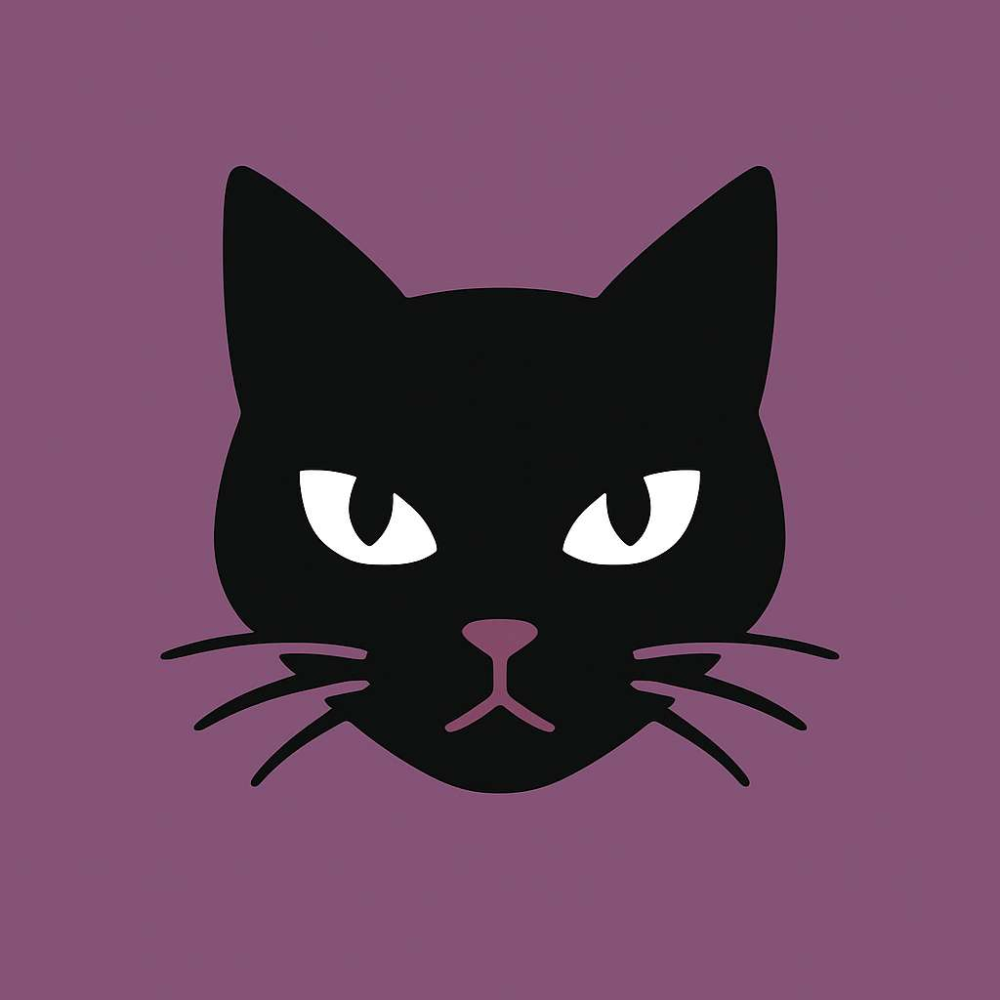
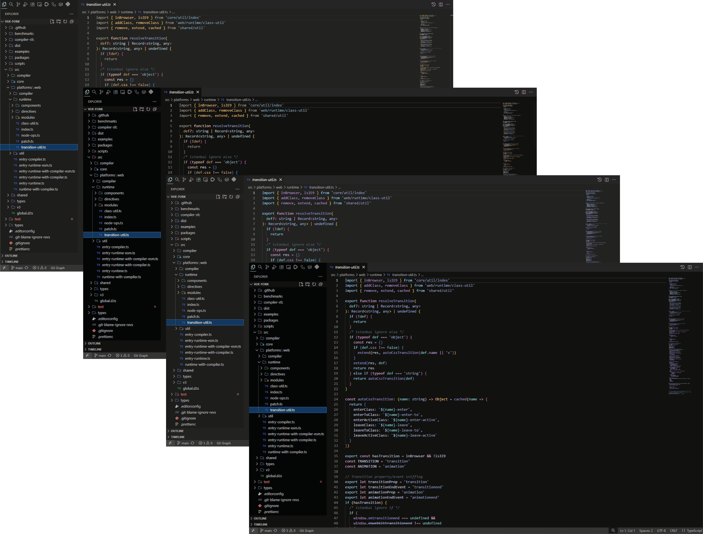
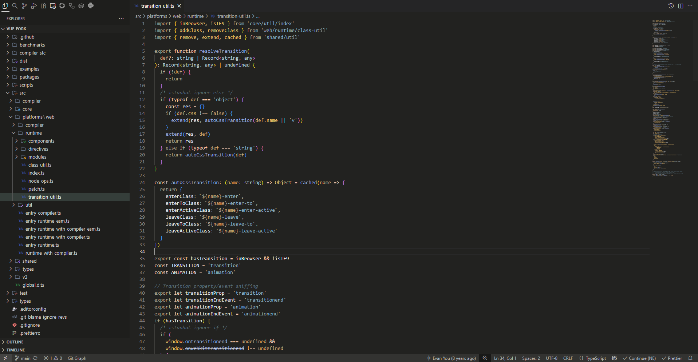
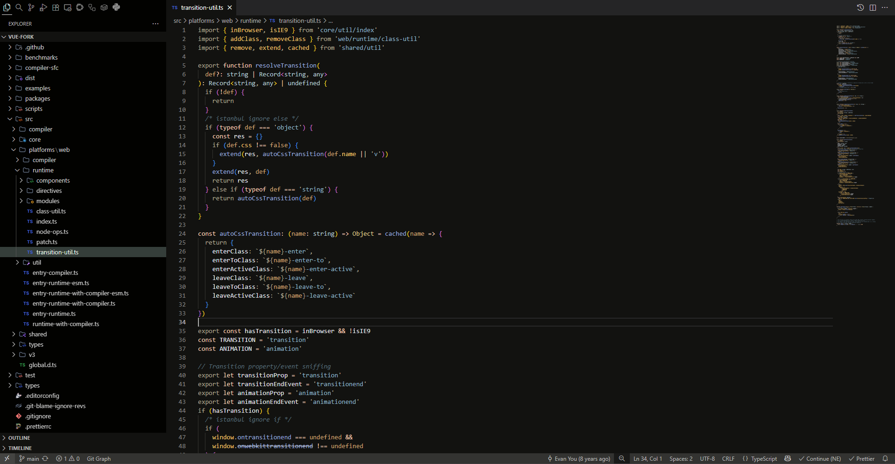
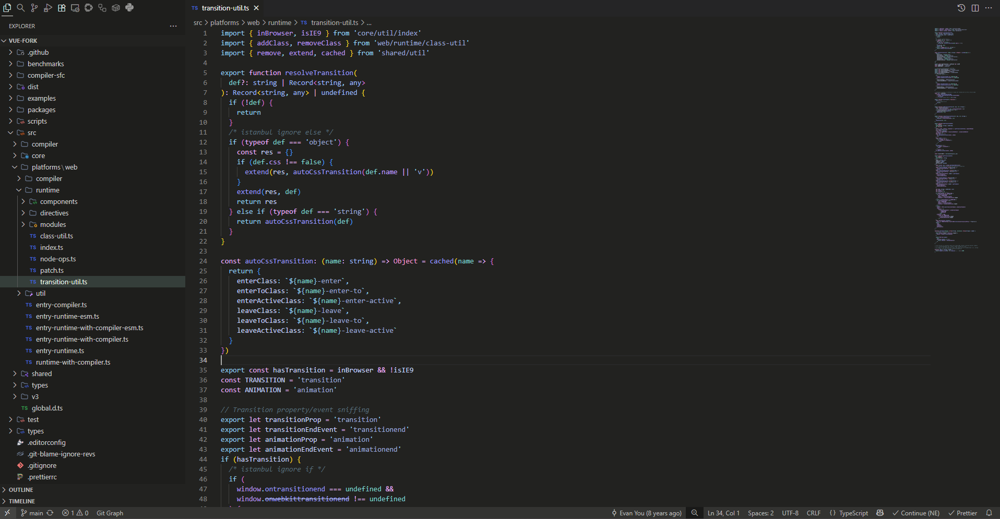

<h3 align="center">
	 
	Blackcat for <a href="https://code.visualstudio.com">VSCode</a>
	
</h3>

    

  

## Previews

🌇 Sand

🌆 Sand Darker

🏙️ Night

🌃 Night Darker

## Usage

### Preferred method of installation

Install the extension from a Marketplace:

- [Visual Studio Marketplace](https://marketplace.visualstudio.com/items?itemName=mathiew82.blackcat)

## Customization

You can find all the available keys to customize your theme [here](https://code.visualstudio.com/api/references/theme-color).

&nbsp;

#### 💝 Thank you for using it

Created by **Mathiew82**  
[Github](https://github.com/Mathiew82) | [Portfolio](https://amateo82.es)
