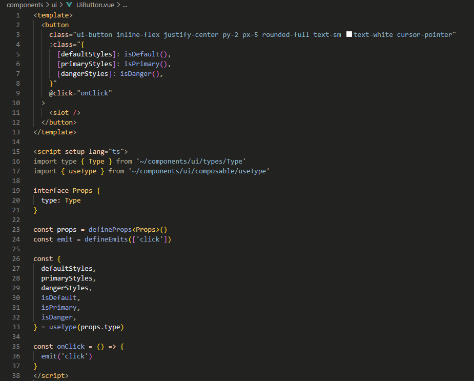
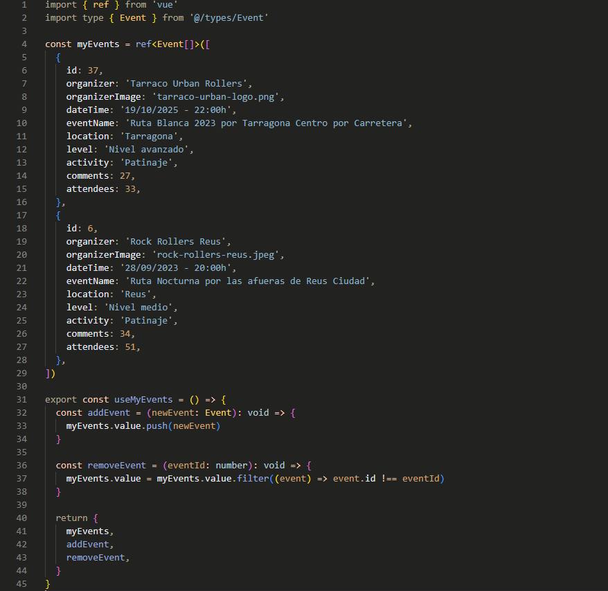
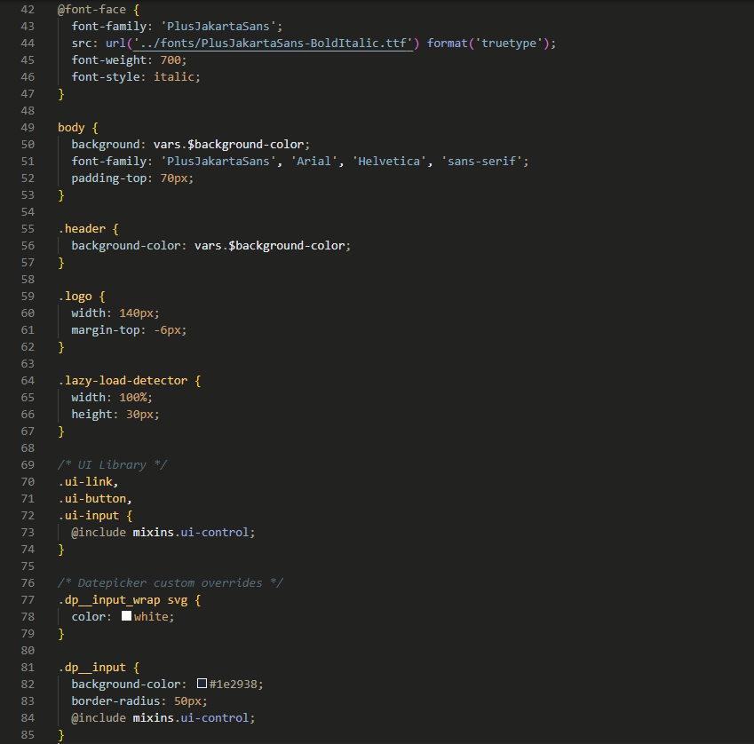

  A stylish cat

- Carefully balanced contrast to reduce eye strain
- Soft, non-glossy colors for better readability

---

  
  

#### 🚀 Installation

1. Open VS Code
2. Go to **Extensions (Ctrl+Shift+X)**
3. Search for `BlackCat`
4. Click **Install**

---

#### ❤️ Credits

Created by **Mathiew82**  
[Github](https://github.com/Mathiew82) | [Portfolio](https://amateo82.es)
